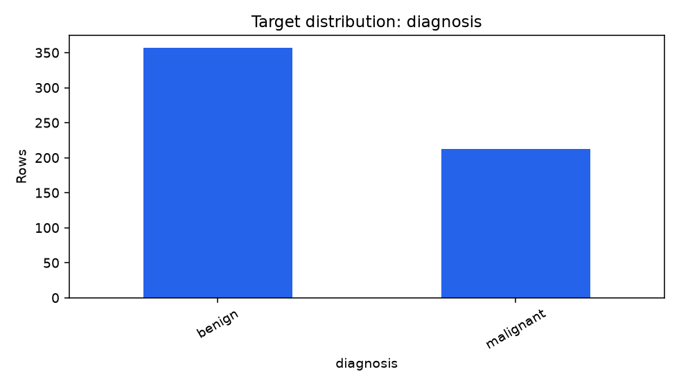
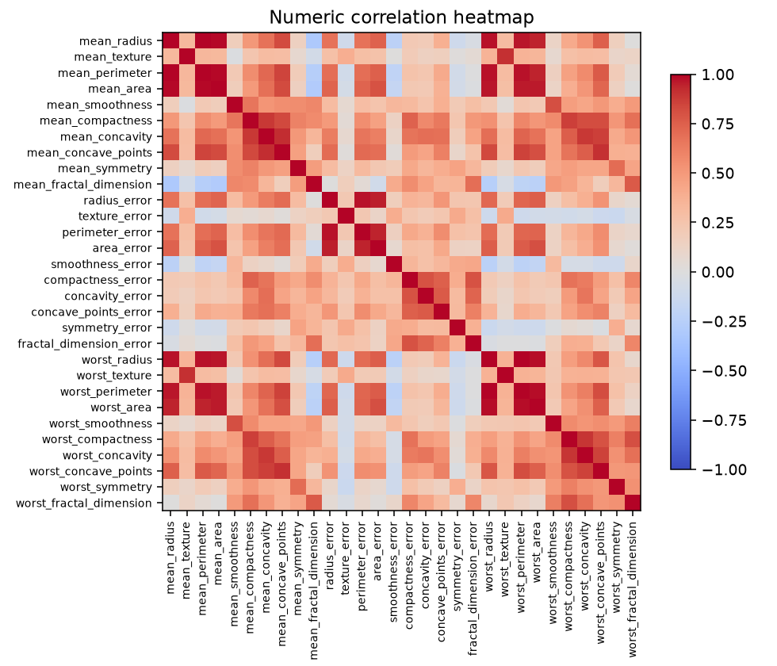

# Demo run

The bundled classification walkthrough uses the Breast Cancer Wisconsin
benchmark only as a software demonstration. The workflow produced a
regularized logistic model after the independent plan and deterministic plan
agreed at the pre-training gate.

- 569 rows and 30 measured features
- 5-fold stratified cross-validation
- CV macro F1: 0.9714 ± 0.0197
- untouched holdout macro F1: 0.9810
- baseline holdout macro F1: 0.3871

The figures below are generated by `app.deterministic.make_plots` from the
cleaned run artifacts.

