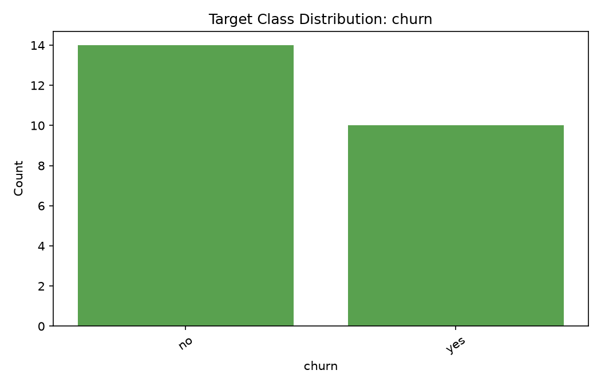
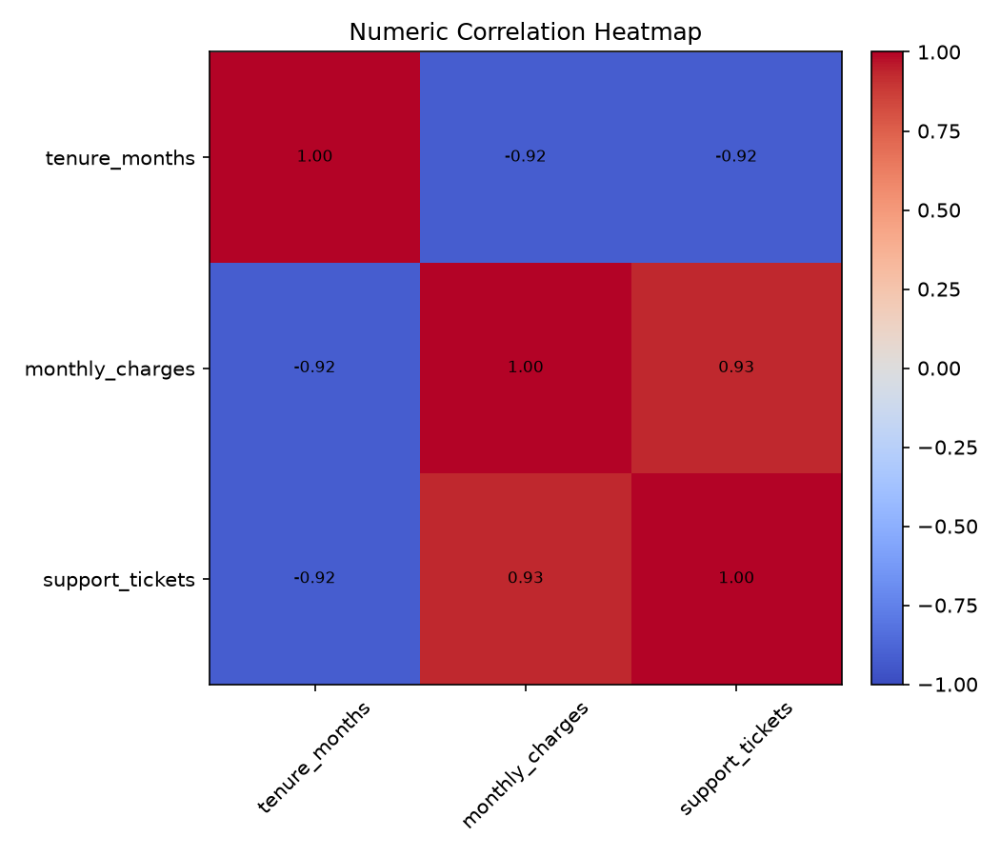
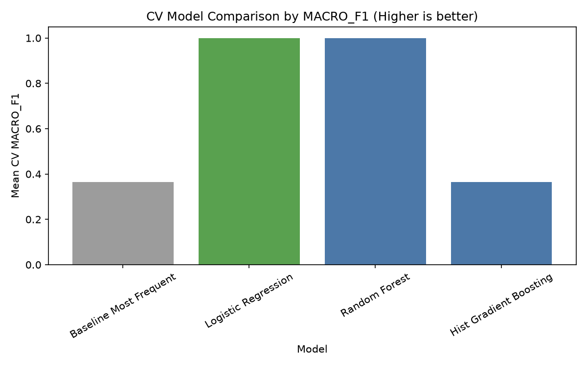

# Verified Demo Gallery

These figures are genuine artifacts from a completed local run of `classification_churn.csv` with target `churn`. The workflow profiled and cleaned the data, generated EDA, compared models with training-only cross-validation, evaluated the selected model, and persisted a completed final report. The selected model for this small synthetic demonstration was logistic regression.

The gallery is intentionally kept outside `runs/` so reviewers can inspect representative product output on GitHub without committing an entire generated run folder.

## Target class distribution

## Correlation analysis

## Cross-validation model comparison

To refresh the gallery, repeat the documented classification flow in [the demo walkthrough](../demo_walkthrough.md) and replace all three figures from the same successful run.
